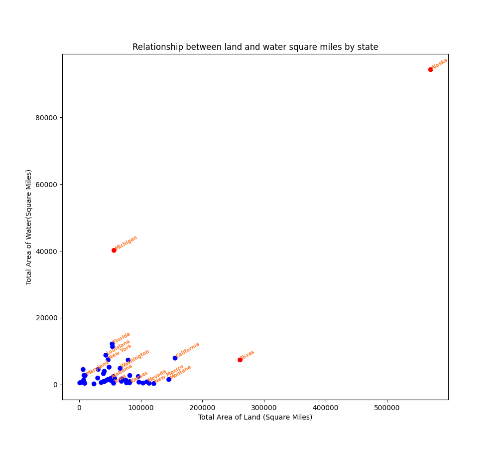
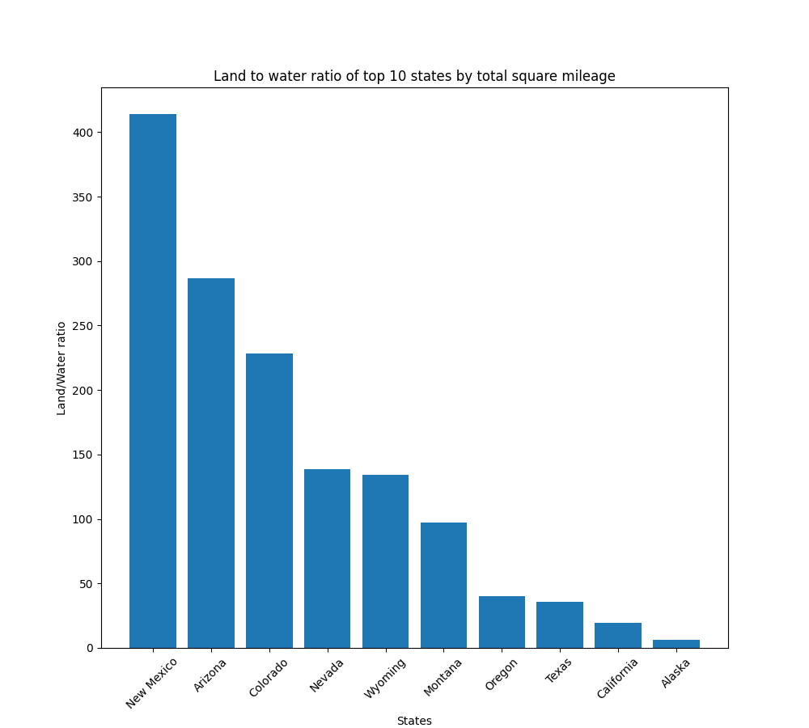
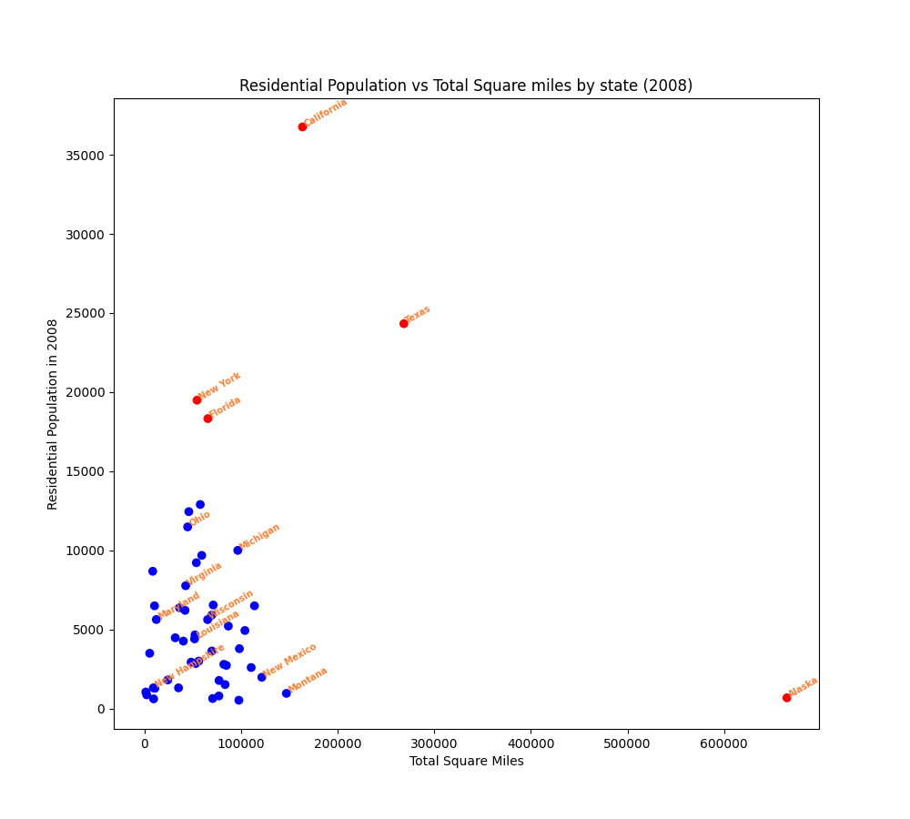

Dakota Scott
CS625-HW4
Due: 10/27/24

# Report
## Question 1
### For each state, show the relationship between the state's land area and its total water area. Consider only the 50 US states (Alabama - Wyoming), ignore DC and the territories. Highlight any interesting outliers.
  
[Link to Image](Relationship_between_land_and_water_area_final.png)  

Idiom: Scatter Plot / Mark: Point
| Data: Attribute | Data: Attribute Type  | Encode: Channel | 
| --- |---| --- |
| Total land area (Square Miles) | key, quantitative | outer horizontal spatial region (x-axis) |
| Total water area (Square Miles) | value, quantitative | vertical position on a common scale (y-axis) |
| State | categorical | horizontal and vertical position of labels |
| Outlier Status | Boolean categorical | color hue (Red if outlier otherwise Blue) |

[Original Data Set (Table 346)](table_346_unrefined.csv)  
[Refined Data Set](table_346.csv)  
[Python Code](hw4.py)  

To answer question 1, I needed to convey the relationship between each state's land area and each state's water area. Both are quantitative values of the elements; thus, a scatter plot
was a good idiom to convey this information. I could represent the magnitude of each quantitative value based on its position relative to a common axis. To display this information,
each state is represented by a dot, and the position of the dot is determined by the respective keys and values relative to the common axes. To further clarify which dot represented
which state, some of the dots were labeled with the name of the state. This information was used to identify all outliers, as well as label some inliers. To maintain clarity, not all inliers
were labeled as the diagram would become very cluttered and the text would not be legible. To further increase legibility, the text was written in orange to contrast more clearly
with both the white background and the blue inliers. Further, the outliers are illustrated as red circles, denoting that they are not part of the normal group. From this chart, I was able to see that
Alaska is significantly bigger than all other states in both water and land area. I also noticed that Texas is significantly larger than all other states in terms of land area and that Michigan is far larger
than all other states in total water area.

## Question 2
### Pick 10 states and compare the proportion of their total area that is land and the proportion that is water. You may pick the 10 states however you wish (e.g., 10 largest, 10 smallest, 10 largest based on land area, 10 largest based on water area, 10 favorite states), but you must discuss how you chose the states.
  
[Link to Image](Land_water_ratio_top_10_states_final.png)  

Idiom: Bar Chart / Mark: Line
| Data: Attribute | Data: Attribute Type  | Encode: Channel | 
| --- |---| --- |
| State | Key, Categorical | Labels on x-axis to encode identity |
| Ratio of land area to water area | Value, Quantitative | Vertical position on a common scale (x-axis) |

[Original Data Set (Table 346)](table_346_unrefined.csv)  
[Refined Data Set](table_346.csv)  
[Python Code](hw4.py)  

For question 2, I decided that I wanted to represent the proportion of land area to water area of the top 10 largest states by total area. To do this, I needed to represent the relationship
between the top 10 states, which is a set of categorical keys, and their respective land/water ratios which are quantitative. I represented this with a bar chart where I could label each bar
with its corresponding state to show the categories and use the vertical height of the bar chart as the magnitude of the quantitative ratios. To more appropriately display the values of the
land/water ratios relative to one another, the data was sorted descending by ratio so similar values are adjacent. To make sure that the text does not overlap, reducing clarity, the state names were rotated.
From this chart, I noticed that the states with the greatest land-to-water ratio, such as New Mexico, Nevada, and Colorado tend to be in the Midwest. One interesting observation is that although
Alaska is the largest state by both total land area and total water area, it has the lowest land/water ratio, meaning that it is relatively similar in terms of its land area and water area.

## Bonus Question
### Extra Credit [2 points]: Combine this table with Table 12 (Resident Population, from Section 1 - Population) to show the relationship between land area and 2008 population for each state.
  
[Link to Image](Land_area_and_population_2008_final.png)  
Idiom: Scatter Plot / Mark: Point
| Data: Attribute | Data: Attribute Type  | Encode: Channel | 
| --- |---| --- |
| Total land area (Square Miles) | key, quantitative | outer horizontal spatial region (x-axis) |
| Population in 2008 | value, quantitative | vertical position on a common scale (y-axis) |
| State | categorical | horizontal and vertical position of labels |
| Outlier Status | Boolean categorical | color hue (Red if outlier otherwise Blue) |

[Original Data Set (Table 12)](table_012_unrefined.csv)  
[Refined Data Set](table_012.csv)  
[Combined Data Set](table_012_and_346_2008.csv)  
[Python Code](hw4.py)  

To answer the bonus question, I needed to combine and then cross-reference Table 12 and Table 346 and then plot the relevant data for each state. To do so, I first needed to isolate the population of each state in 2008.
All column headers in Table 12 contained months, but this was not necessary information so they were removed. A dataframe was constructed that only contained the identifying information categories
of each state i.e. the state's name, postal code, and fips code, as well as the state's population in 2008. This dataframe from Table 12 was then merged with a dataframe containing Table 346 by the states' names.
From this merged dataframe (Combined Data Set) corresponding lists of total land area and population in 2008 were extracted and used as the x and y values for the scatterplot, respectively. Similarly to Question 1, 
this task requires illustrating the relationship between two quantitative variables. To best illustrate this relationship I employed the idiom of a scatter plot to use points on two axes to show the corresponding values of each point based on their positions on common scales. Similar to Question 1, I labeled all of the outliers and some of the inliers; as well, the outlier points are colored red, and the inlier points are colored blue. To increase legibility, only some of the inliers were labeled to minimize overlap, and all labels were rotated and written in orange to contrast the blue inliers and the white background of the chart.

# Further Questions

In further explorations, it would be interesting to take these same measurements for several years, and then plot how the values change. It would explore the question "How has/does the composition of each state change over time?". For example, as climate change becomes more extreme and sea levels rise, how much of Florida will become underwater? How does the population change correspond to the change in the land/water ratio? It seems like in the future the land/water ratio will decrease as sea levels rise, and perhaps populations decrease among coastal states. This would need information similar to Table 346 but for several years in a row; it would also need the state populations in Table 12 for each of the years in the aforementioned table.

# References
1. https://www.grepper.com/answers/824560/how+to+convert+a+pandas+string+column+to+numbers?ucard=1
2. https://stackoverflow.com/questions/25698710/replace-all-occurrences-of-a-string-in-a-pandas-dataframe-python
3. https://www.grepper.com/answers/38631/apply+strip%28%29+a+column+in+pandas?ucard=1
4. https://stackoverflow.com/questions/54668896/remove-some-elements-from-python-pandas-data-frame
5. https://pandas.pydata.org/docs/reference/api/pandas.DataFrame.drop.html
6. https://www.w3schools.com/python/ref_random_randint.asp
7. https://stackoverflow.com/questions/52304992/passing-a-string-variable-to-rename-function-pandas
8. https://learning.oreilly.com/library/view/visualization-analysis-and/9781466508910/?sso_link=yes&sso_link_from=old-dominion-university
